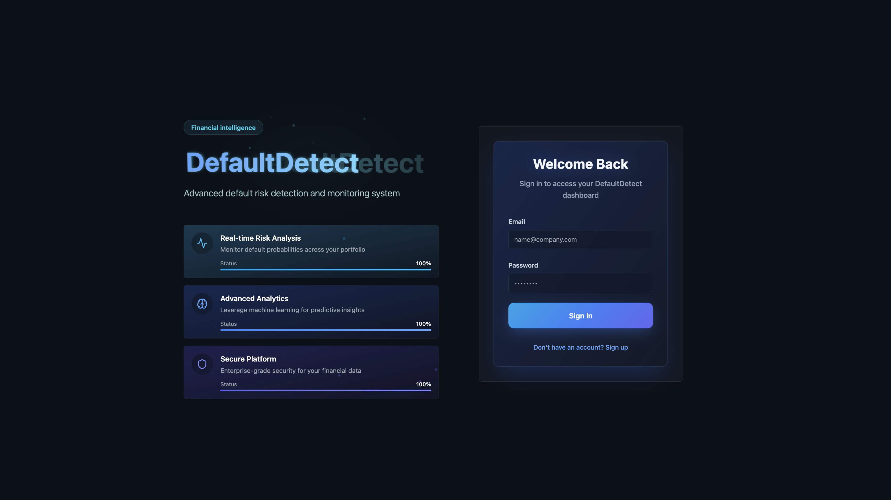
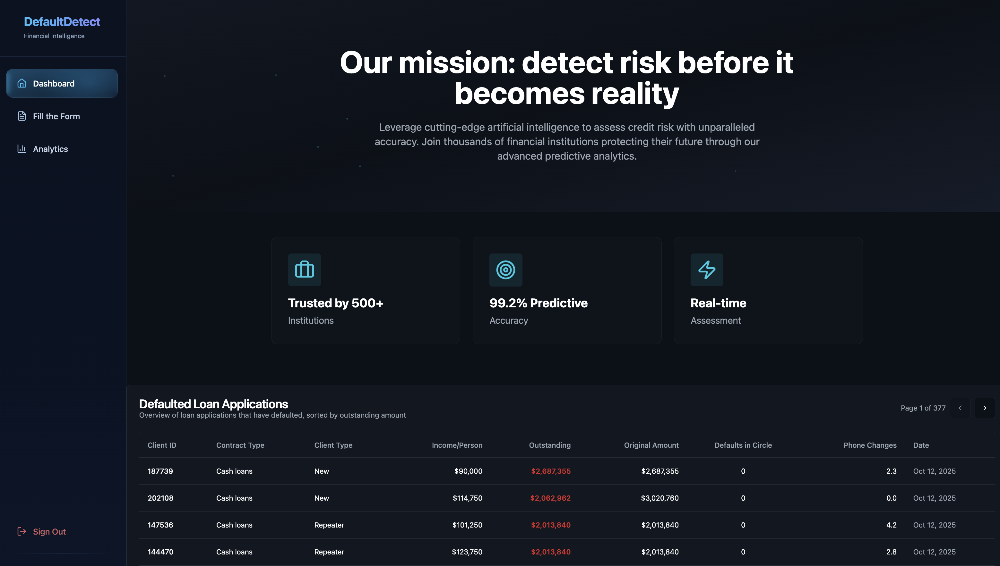
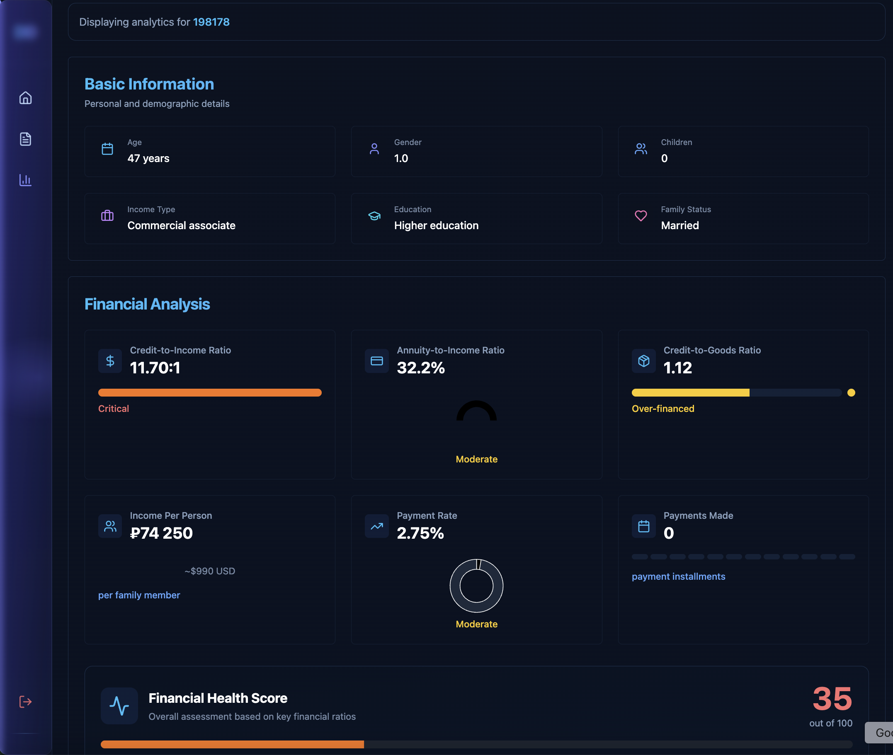
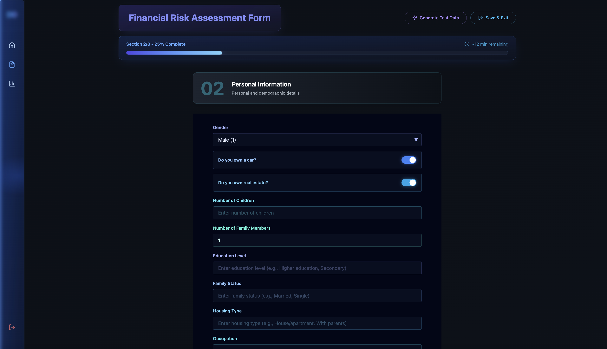

<p align="center">
  
</p>

<h1 align="center">🧠 DefaultDetect</h1>
<p align="center">
  <b>AI-powered loan default risk detection platform combining ML predictions, automated PDF generation, and real-time analytics.</b>
</p>


## 🏦 1. Project Overview & Problem Statement

### **Real-World Context**
Financial institutions face challenges with **manual loan risk assessment processes** that are slow, inconsistent, and prone to human error.

### **The Gap**
There is a lack of **automated, data-driven risk prediction systems** capable of processing large volumes of applications efficiently.

### **Business Impact**
Ineffective assessment leads to **billions in potential losses** from loan defaults each year.

<p align="center">
  
  
</p>

<p align="center">
  
  
</p>

## 💡 2. Solution Summary

**DefaultDetect** is an intelligent platform for automated **loan default risk detection**.

### **Core Innovation**
- Combines ML-powered risk prediction with automated document generation and analytics  
- Real-time scoring, auto-save, and PDF reporting

### **Architecture Flow**
`React Frontend → Supabase Backend → Edge Functions → ML API → PDF Generation → Storage`

### **Key Differentiators**
- ⚡ Real-time risk scoring  
- 🧾 Automated PDF generation  
- 📊 Bulk data processing  
- 💾 Auto-save functionality  

<p align="center">
  
</p>


## ⚙️ 3. Full Tech Stack

| Layer | Technology | Description |
|-------|-------------|-------------|
| **Frontend** | React 18.3.1 + TypeScript 5.8.3 | Modern UI with type safety |
|  | Tailwind CSS + shadcn/ui | Consistent design system |
|  | Radix UI + React Router DOM | Accessible primitives & routing |
|  | React Query + Recharts + Framer Motion | State management, data viz & animation |
| **Backend** | Supabase PostgreSQL + PostGIS | Relational DB with spatial support |
|  | Supabase Auth + RLS | Authentication & access control |
|  | Supabase Storage | File & PDF storage |
| **Serverless** | Supabase Edge Functions (Deno) | Serverless backend logic |
| **PDF Generation** | jsPDF 3.0.3 | Client-side & server-side report generation |
| **Dev Tools** | ESLint, PostCSS, Autoprefixer, Lovable | Linting, build, and deploy pipeline |


## 🧩 4. Supabase Edge Functions

### **1. `generate-test-data`**
- **Purpose:** Generate synthetic loan application data  
- **Trigger:** `HTTP POST`  
- **Logic:** Randomized variations (income ±15%, age ±3)  
- **Output:** New `loan_staging` records  
- **Security:** Public (demo mode)

### **2. `generate-loan-pdf`**
- **Purpose:** Create detailed loan risk reports  
- **Trigger:** `AFTER UPDATE OF risk_score`  
- **Logic:** Fetch record → generate professional PDF → upload to storage  
- **Output:** `pdf_path` updated in database  
- **Security:** Service role permissions only  

### **3. `bulk-load-csv`**
- **Purpose:** Bulk import large CSV datasets (1GB+)  
- **Trigger:** `HTTP POST`  
- **Logic:** Parse & batch insert (500 rows)  
- **Output:** Import statistics  
- **Security:** Demo-public; protect in production  


## 🗃️ 5. Database Structure

### **Main Tables**

#### **`loan_staging`** (150+ columns)
| Column | Description |
|---------|--------------|
| `id` | Primary key |
| `sk_id_curr` | Unique client ID |
| `target` | Prediction result (0/1/null) |
| `risk_score` | ML-predicted default probability |
| `ml_api_status` | Pipeline state: pending / processing / completed |
| `pdf_path` | Generated PDF storage URL |
| `prediction_timestamp` | Timestamp of prediction |

**Triggers**
- `on_loan_staging_insert` → calls ML prediction webhook  
- `on_loan_staging_risk_updated` → calls PDF generator  

#### **`profiles`**
Stores user metadata linked to Supabase Auth users.  
Each user can only CRUD their own profile.

#### **`user_roles`**
Implements role-based access (`admin`, `user`) with RLS enforced.

### **Database Functions**
- `trigger_ml_prediction_webhook()` – Calls ML API  
- `trigger_pdf_generation()` – Triggers PDF generation  
- `has_role(_user_id, _role)` – Role checker  
- `handle_new_user()` – Auto-create profile on signup  


## 🖥️ 6. Frontend & User Interface

### **Design System**
- **Theme:** Dark gradient (`#0b1220 → #0b1528`)  
- **Accents:** Sky Blue `#38bdf8`, Indigo `#6366f1`  
- **Typography:** Inter  
- **UI:** shadcn/ui + Radix primitives  
- **Animations:** Framer Motion  

<p align="center">
  
</p>

### **Main Pages**
- **Dashboard** — KPIs, real-time risk tables  
- **Form** — 8-step multi-section form (109 fields, auto-save)  
- **Analytics** — Risk visualizations, ratios, charts  
- **Bulk Import** — CSV uploader & progress monitor  
- **Form Success** — Summary + PDF download  

### **Key Interactions**
- Auto-save every 20s & on navigation  
- Section validation with toasts  
- Keyboard shortcuts & spinners  
- Toasts for success/errors  
- Confetti animation 🎉  


## 🧠 7. Core Functionalities & Logic

### **Storage Buckets**
| Bucket | Purpose |
|---------|----------|
| `data` | CSV file uploads |
| `loan-pdfs` | Auto-generated loan reports |

**Naming convention:**  
`reports/loan_report_{SK_ID_CURR}_{timestamp}.pdf`

**Access control:**  
- Public read, service role write  
- Organized by date  

### **Upload / Download Flow**
1. CSV uploaded → `data` bucket  
2. Edge Function processes → inserts data  
3. ML predicts → updates risk_score  
4. PDF generated → uploaded → linked in DB  

### **PDF Generation**
| Type | Library | Trigger | Output |
|------|----------|----------|---------|
| **Client-side** | jsPDF | User form submission | 11-section report |
| **Server-side** | jsPDF (Edge) | `AFTER UPDATE OF risk_score` | Automated report upload |

### **Auto-Save System**
- Saves to `localStorage` as JSON every 20s  
- Restores draft on reload  
- Displays “last saved” timestamp  

### **Auth & Roles**
- Roles: `user` (self), `admin` (manage all)  
- RLS enforced on all tables  
- Tokens auto-refresh  

### **Error Handling**
- **Frontend:** Try-catch, toast errors  
- **Edge Functions:** Descriptive responses  
- **Database:** Rollbacks + warnings  


## 🚀 8. Deployment & Environment Setup

### **Production Deployment**
| Component | Platform | Notes |
|------------|-----------|-------|
| Frontend | **Lovable** | Auto-deploy on push |
| Backend | **Supabase** | Managed PostgreSQL + Edge Functions |
| Domain | Custom domain | SSL enabled |


### **Local Development Setup**
```bash
# 1. Clone repository
git clone <repo-url>
cd defaultdetect

# 2. Install dependencies
npm install

# 3. Start dev server
npm run dev

# 4. Build for production
npm run build

# 5. Preview production build
npm run preview
